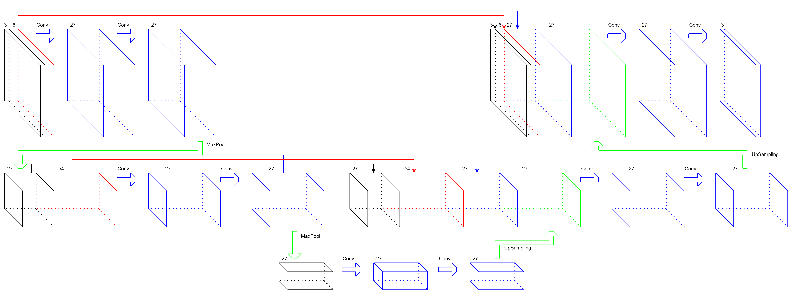
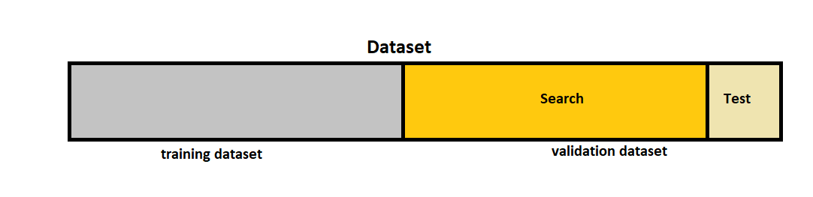
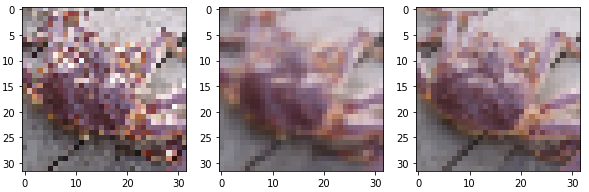
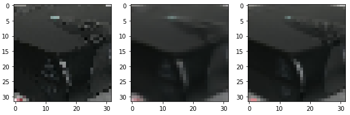
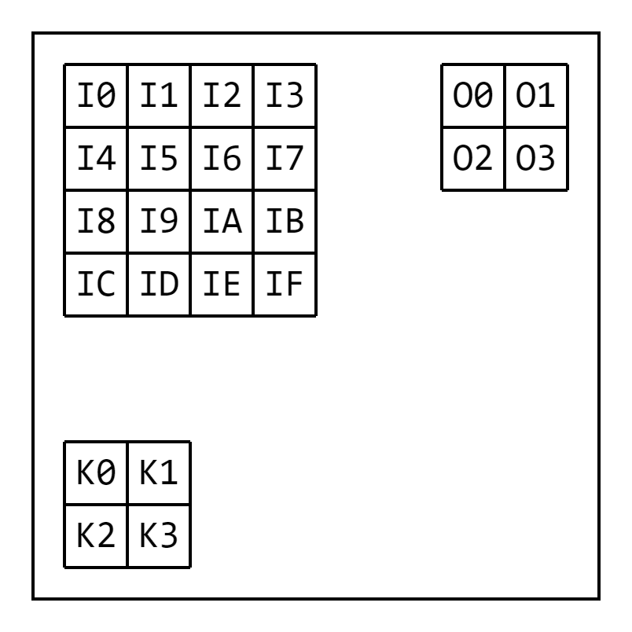
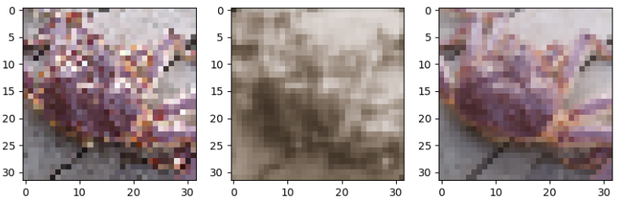
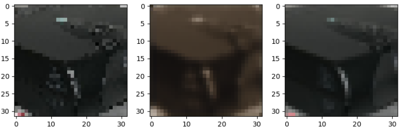

# Noise2Noise — Image Denoising Without Clean Targets

Two implementations of the Noise2Noise denoising framework (Lehtinen et al. 2018), built for the EPFL Deep Learning course (Prof. François Fleuret, May 2022).

**Authors:** Albian Salihu, Robin Plumey

---

## The Core Idea

Standard denoising networks learn by mapping a noisy image to its clean counterpart. Noise2Noise eliminates that requirement: given two independently noisy versions of the same underlying image, a network trained to map one onto the other converges to the same solution as if it had seen clean targets. The key insight is that noise has zero mean — so the network learns to predict the expected (clean) signal.

---

## Results

| | Mini-project 1 | Mini-project 2 |
|---|---|---|
| **Approach** | FFT-augmented U-Net | From-scratch framework |
| **Framework** | PyTorch (`torch.nn`, `autograd`) | Pure PyTorch tensors only |
| **PSNR (test set)** | **25.4350 dB** | **20.4185 dB** |
| **Epochs** | 15 (≤ 45 min) | 4 |
| **Optimizer** | ADAM | ADAM (hand-coded) |
| **Loss** | MSE | MSE (hand-coded) |

---

## Mini-project 1 — FFT-Augmented U-Net

### Architecture

The model is a nested encoder-decoder (U-Net style) built from three `ConvPoolConvTranspose2d` blocks stacked recursively. Each block encodes with 3×3 convolutions, max-pools into the next level, then decodes with bilinear upsampling and skip connections that concatenate encoder and decoder features.

The key augmentation is an FFT branch: at two levels of the network, the feature map is split into low-frequency and high-frequency components via a 2D FFT, and both are concatenated alongside the spatial features before decoding. This gives the model an explicit frequency-domain view of the noise pattern.

The final layer configuration (Chan1 = Chan2 = Chan3 = 9, giving 27 channels per level):

| Layer | Channels out | Operation |
|---|---|---|
| INPUT | 3 | — |
| FFT₀ | 6 | Split input into high/low frequencies |
| Concat₀ | 9 | Concatenate INPUT + FFT₀ |
| Enc_conv₀, Enc_conv₁ | 27 | Conv 3×3, padding 1×1 |
| Pool₁ | 27 | MaxPool 2×2 |
| FFT₁ | 54 | Split Pool₁ into high/low frequencies |
| Concat₁ | 81 | Concatenate Pool₁ + FFT₁ |
| Enc_conv₂, Enc_conv₃ | 27 | Conv 3×3, padding 1×1 |
| Pool₃ | 27 | MaxPool 2×2 |
| Enc_conv₄, Dec_conv₄ | 27 | Conv 3×3, padding 1×1 |
| UpSampling₄ | 27 | Upsample 2×2 |
| Concat₂ | 135 | Concat₁ + Enc_conv₃ + UpSampling₄ |
| Dec_conv₃, Dec_conv₂ | 27 | Conv 3×3, padding 1×1 |
| UpSampling₂ | 27 | Upsample 2×2 |
| Concat₃ | 135 | Concat₀ + Enc_conv₁ + UpSampling₂ |
| Dec_conv₁ | 27 | Conv 3×3, padding 1×1 |
| Dec_conv₀ | 3 | Conv 3×3, padding 1×1 |



### Parameter Search

Hyperparameters were searched in three sequential runs, each building on the last:

- **Run 1 — Channel sizes:** 125 training runs across combinations of channel counts per layer. Found Chan1 = Chan2 = Chan3 = 9 (27 channels each level).
- **Run 2 — FFT cutoffs:** Tested `add_fft` values of [0, 3, 5, 7] for each level. Found `add_fft_1 = 7`, `add_fft_2 = 3`.
- **Run 3 — Learning rate:** Coarse search to bracket the optimum, then fine search with smaller increments. Found `lr = 2.1e-3`.

The number of layers was evaluated separately (2, 3, 4): 3 layers was the best compromise between training speed and PSNR.

To avoid data leakage, the validation set was split: 80% used for PSNR measurement during the parameter search, the remaining 20% held out for final evaluation only.



### Validation predictions

Columns: noisy input | model output | clean target



### Test predictions



---

## Mini-project 2 — From-Scratch Framework

The same Noise2Noise training objective is implemented without using `torch.nn` or `torch.autograd`. Every component is hand-coded using only raw PyTorch tensors:

- **`Conv2d`** — forward pass via `unfold` + matrix multiply. Backward pass computes three gradients analytically:
  - *w.r.t. input*: equivalent to a convolution with the kernel rotated 180°, applied to the dilated gradient output
  - *w.r.t. kernel*: a convolution of the input with the dilated gradient output (stride = 1)
  - *w.r.t. bias*: sum of the gradient over spatial dimensions and batch
- **`NearestUpsampling`** — forward via `repeat_interleave`; backward sums the gradient tiles back into the original spatial positions using `unfold`
- **`Sigmoid`** — input clipped to [−64, 64] before computing exp, to prevent `inf`/`nan` in the backward pass
- **`ReLU`**, **`LeakyReLU`** — element-wise with explicit gradient masks
- **`Sequential`** — chains `forward_pass` and `backward_pass`, threading (output, context) tuples between layers
- **`MSE`** — loss and gradient
- **`ADAM`** — full adaptive moment estimation with bias correction, implemented from scratch in `step_()`
- **`Model`** — `Sequential` + `ADAM`; weights serialised to a human-readable text file (not binary)

The architecture is a lightweight 3-layer CNN: 3 → 9 → 9 → 3 channels, with ReLU activations and a Sigmoid output.

### Convolution forward/backward

The diagram below illustrates how `unfold` converts the convolution into a matrix multiply for the forward pass, and how the backward passes for input and kernel gradients are implemented as further convolutions:



### Validation predictions

Columns: noisy input | model output | clean target



### Test predictions



---

## Setup

```bash
pip install -r requirements.txt
```

The dataset (`train_data.pkl`, `val_data.pkl`) is distributed by the EPFL Deep Learning course and is not included in this repository. Place both files in a `data/` directory one level above the miniproject directories:

```
Noise2Noise/
├── data/
│   ├── train_data.pkl
│   └── val_data.pkl
├── miniproject_1/
└── miniproject_2/
```

---

## Running

**Mini-project 1** (trains for up to 45 minutes, 15 epochs):

```bash
cd miniproject_1
python train.py
```

**Mini-project 2** (trains for 4 epochs):

```bash
cd miniproject_2
python train.py
```

Both scripts save weights to `bestmodel.pth` in the same directory and print the validation PSNR on exit.

---

## Portfolio Note

This repository is a cleaned-up version of the original submission. The algorithm code (`model.py` in both miniprojects) is **untouched** — every weight, gradient formula, and hyperparameter is exactly as submitted. Only the entry points were modified:

| Change | Detail |
|---|---|
| `__init__.py` → `train.py` | Renamed for clarity; the original used `__init__.py` as a script |
| Bug fix — `torch.save('bestmodel.pth')` | Missing the object to save. Fixed to `model.save_model('bestmodel.pth')` (the `Model` class has this method) |
| Path separator hack removed | `split = '\\' if '\\' in os.getcwd() else '/'` replaced with `os.path.join(...)` throughout both `train.py` files |
| French comments translated | `#les imports:`, `#save dans bestmodel`, `#load best model :` cleaned up |
| Duplicate `import os` removed | Miniproject 2's `__init__.py` imported `os` twice |
| Module import fixed | `from Miniproject_N.model import Model` → `from model import Model` to work when run from inside the miniproject directory |
| `miniproject_2/other/test_model.py` removed | The original file was a development scratch file: it contained `assert(False)` mid-script, called a non-existent method (`compute_gradwrtinput_v2`), and used a wrong parameter key (`'Conv2d.kernel'`). It would crash immediately and added no value to the repository |

---

## Credits

Developed by **Albian Salihu** and **Robin Plumey** as part of the EPFL Deep Learning course (EE-559), Spring 2022.

Architecture inspired by: Lehtinen et al., *Noise2Noise: Learning Image Restoration without Clean Data*, ICML 2018.
